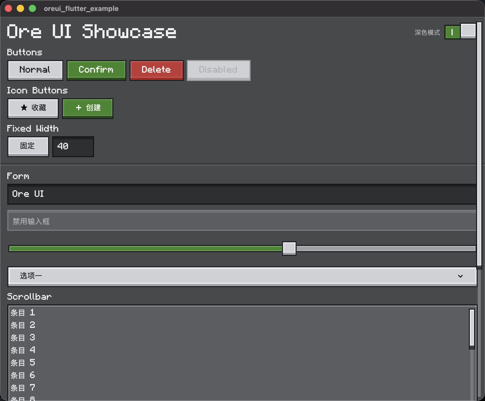
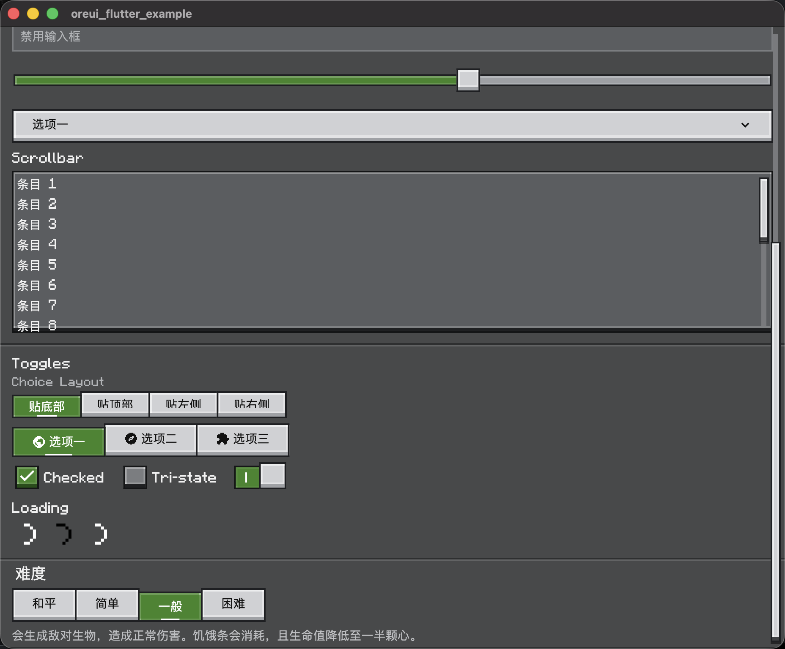

# oreui_flutter

[简体中文](#简体中文)

A pixel/voxel‑inspired Flutter UI kit that brings the Ore UI aesthetic to your apps (unofficial, not affiliated).




**Features**
- Unified Ore theme system with light/dark support
- Pixel‑style visuals: crisp edges, bold borders, bevel highlights, and shadows
- Built‑in fonts and pixel icon assets
- Ready‑to‑use widgets with consistent styling and ergonomics

**Installation**
Add the dependency to your `pubspec.yaml`:

```yaml
dependencies:
  oreui_flutter: ^0.0.1
```

**Quick Start**

```dart
import 'package:flutter/material.dart';
import 'package:oreui_flutter/oreui_flutter.dart';

void main() {
  runApp(
    OreThemeBuilder(
      controller: OreThemeController(),
      builder: (context, data, brightness) {
        return MaterialApp(
          debugShowCheckedModeBanner: false,
          theme: ThemeData(
            brightness: brightness,
            extensions: [data],
          ),
          home: const ExamplePage(),
        );
      },
    ),
  );
}

class ExamplePage extends StatelessWidget {
  const ExamplePage({super.key});

  @override
  Widget build(BuildContext context) {
    final ore = OreTheme.of(context);
    return Scaffold(
      backgroundColor: ore.colors.background,
      body: Center(
        child: OreButton(
          label: 'Start',
          onPressed: () {},
        ),
      ),
    );
  }
}
```

**Theming**
Use `OreTheme.of(context)` to access colors and typography. You can derive a custom theme like this:

```dart
final base = OreThemeData.fromBrightness(brightness);
final data = base.copyWith(
  colors: base.colors.copyWith(
    accent: const Color(0xFF4CAF50),
  ),
);
```

**Widgets**
- `OreButton`
- `OreCard`
- `OreCheckbox`
- `OreChoiceButtons`
- `OreChoiceDescription`
- `OreChoiceTitle`
- `OreDivider`
- `OreDropdownButton`
- `OreLoadingIndicator`
- `OrePixelIcon`
- `OreScrollbar`
- `OreSlider`
- `OreStrip`
- `OreSurface`
- `OreSwitch`
- `OreThemeModeSwitch`
- `OreTextField`

**Example**
Run the example app in `example/`. The entry widget is `OreShowcaseApp`.

**Attribution**
- Ore UI is © Mojang Studios (Sweden).
- Official repository: https://github.com/Mojang/ore-ui
- Reference repository: https://github.com/Spectrollay/OreUI

## 简体中文

像素/方块风格的 Flutter 组件库，提供 Ore UI 主题与基础控件（非官方关联）。

**特性**
- 统一的 Ore 主题系统，支持明暗模式切换
- 像素化视觉语言：硬边、描边、立体高光与阴影
- 内置字体与像素图标资源
- 组件化封装，方便直接使用或二次扩展

**安装**
在 `pubspec.yaml` 添加依赖：

```yaml
dependencies:
  oreui_flutter: ^0.0.1
```

**快速开始**
参考上方英文示例即可。

**版权声明**
- Ore UI 版权归瑞典 Mojang Studios 所有。
- 官方仓库： https://github.com/Mojang/ore-ui
- 参考仓库： https://github.com/Spectrollay/OreUI
